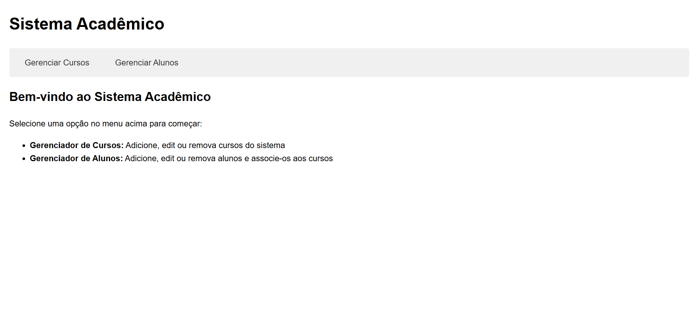
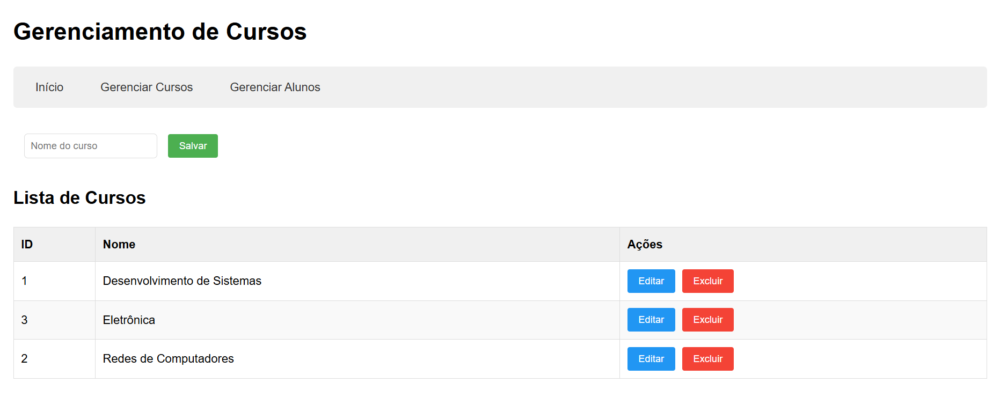
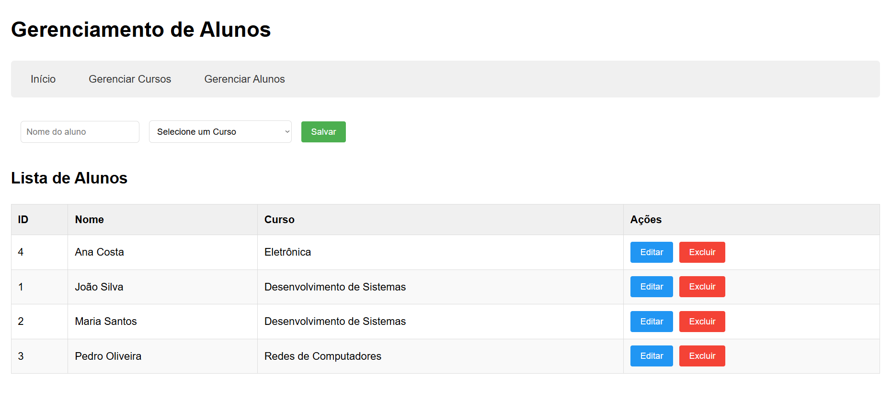

# Sistema Acadêmico SPA

Sistema Acadêmico SPA é um projeto de estudo desenvolvido com **PHP**, **MySQL** e **XAMPP**, utilizando o conceito de **Single Page Application (SPA)** com uma **API** para comunicação entre front-end e back-end.

Este sistema permite a **gestão de cursos e alunos**, com interface simples e interativa, ideal para fins educacionais.

---

## 🧰 Tecnologias Utilizadas

- PHP
- MySQL
- XAMPP
- SPA (Single Page Application)
- API (PHP)
- HTML/CSS/JavaScript

---

## ✨ Funcionalidades

- **Gerenciar Cursos**: Adicionar, editar e remover cursos do sistema.
- **Gerenciar Alunos**: Adicionar, editar e remover alunos, associando-os a cursos existentes.
- **Interface SPA**: A navegação ocorre sem recarregamento de página.
- **Integração com API**: Toda comunicação com o banco de dados é feita via API REST em PHP.

---

## 🚀 Instruções para Execução

1. Inicie o servidor Apache e MySQL pelo **XAMPP**.
2. No terminal, execute os comandos para criar o banco de dados:

```bash
cd \
cd xampp
cd mysql
cd bin
.\mysql -u root -p

```

3. No prompt do MySQL, execute:

```
DROP TABLE IF EXISTS spa02;

CREATE DATABASE spa02;

USE spa02;

CREATE TABLE IF NOT EXISTS curso (
    IDCURSO INT AUTO_INCREMENT PRIMARY KEY,
    NOME VARCHAR(100) NOT NULL
) ENGINE = INNODB DEFAULT CHARSET = utf8mb4;

CREATE TABLE IF NOT EXISTS aluno (
    IDALUNO INT AUTO_INCREMENT PRIMARY KEY,
    NOME VARCHAR(100) NOT NULL,
    IDCURSO INT,
    FOREIGN KEY (IDCURSO) REFERENCES curso (IDCURSO)
) ENGINE = INNODB DEFAULT CHARSET = utf8mb4;

INSERT INTO curso (NOME) VALUES
('Desenvolvimento de Sistemas'),
('Redes de Computadores'),
('Eletrônica');

INSERT INTO aluno (NOME, IDCURSO) VALUES
('João Silva', 1),
('Maria Santos', 1),
('Pedro Oliveira', 2),
('Ana Costa', 3);

```

4. Copie os arquivos do projeto para a pasta htdocs do XAMPP.

5. Acesse o sistema pelo navegador: http://localhost/SPA02

---

## 🖼️ Demonstração

#### Tela Inicial

> 

#### Gerenciador de Cursos

> 

#### Gerenciador de Alunos

> 
